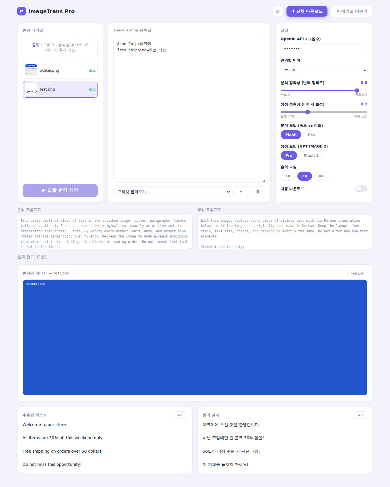

# Image-Translator

이미지를 업로드하면 GPT가 텍스트를 인식·번역하고, **GPT 이미지 2.0(gpt-image-2)** 이 원본 텍스트 자리를 번역문으로 치환한 이미지를 생성해 주는 웹 애플리케이션입니다.



## 동작 방식 (2단계)

1. **분석**: 비전 모델이 이미지와 사용자 사전을 읽고 블록별 원문·번역을 만듭니다.
2. **생성**: 번역 결과로 조립한 **최종 프롬프트**(화면에서 확인 가능)를 이미지 편집 API에 보내, 원본 스타일을 유지한 채 텍스트만 번역문으로 바뀐 이미지를 받습니다.

## 화면 구성

가로 3단 배치: **번역 대기열 | 사용자 사전 | 설정**

- **상단 앱바**: 전체 다운로드(완료된 이미지 일괄 저장), 대기열 비우기
- **번역 대기열**: 여러 장을 클릭/드래그/붙여넣기(Ctrl+V)로 추가하고 **일괄 번역 시작**으로 순차 처리. 항목을 클릭하면 해당 결과를 볼 수 있습니다
- **사용자 사전 & 용어집**: `원문=번역` 줄 형식 또는 JSON — 번역 시 반드시 해당 표기를 따릅니다. **프리셋**으로 저장/불러오기/삭제 가능
- **설정**:
  - 번역할 언어: 한국어 / 영어 / 일본어 / 중국어 / 스페인어 / 프랑스어 / 독일어
  - 분석 정확성 (번역 정확도): 슬라이더 0~1 — 높을수록 숫자·단위·고유명사 검증 지시 추가
  - 생성 정확성 (이미지 보정): 슬라이더 0~1 — 0은 원본 유지, 높을수록 선명화·노이즈 정리
  - 분석 모델: Flash `gpt-5.4-mini` / Pro `gpt-5.5`
  - 생성 모델 (GPT IMAGE 2): Pro `gpt-image-2` / Flash 2 `gpt-image-1-mini`
  - 출력 파일: 1K / 2K / 4K (원본 비율 유지, gpt-image-2는 최대 3840×2160)
  - 자동 다운로드: 켜면 각 항목이 완료될 때마다 자동 저장
- **분석 프롬프트 / 생성 프롬프트**: 두 단계에 전달되는 프롬프트를 항상 표시 (실행 전 미리보기 → 실행 후 실제 사용값)
- API 키·사전·설정·프리셋은 브라우저(localStorage)에만 저장되고 서버에 남지 않습니다

## 설치 및 실행

```bash
pip install -r requirements.txt
uvicorn app.main:app --port 8000
```

브라우저에서 http://127.0.0.1:8000 접속 후 OpenAI API 키를 입력하고 이미지를 업로드하면 됩니다.
API 키는 https://platform.openai.com/api-keys 에서 발급받을 수 있습니다.

## API

UI 없이 직접 호출할 수도 있습니다.

```bash
curl -X POST http://127.0.0.1:8000/api/translate \
  -F "file=@image.png" \
  -F "target_lang=ko" \               # ko | en | ja | zh-CN | es | fr | de
  -F "api_key=sk-..." \               # (필수) OpenAI API 키
  -F "analysis_model=fast" \          # fast(gpt-5.4-mini) | pro(gpt-5.5)
  -F "generation_model=pro" \         # pro(gpt-image-2) | fast(gpt-image-1-mini)
  -F "accuracy=0.5" \                 # 0~1 (또는 fast | balanced | precise)
  -F "enhance=0" \                    # 0~1 (또는 none | sharpen | clean)
  -F "output_size=1k" \               # 1k | 2k | 4k
  -F "glossary=Acme Corp=아크메"      # (선택) 사용자 사전, 한 줄에 하나
```

응답:

```json
{
  "extracted": "Hello, world!",
  "translated": "안녕, 세계!",
  "prompt": "Edit this image: replace every piece of visible text ...",
  "analysis_prompt": "Find every distinct piece of text in the attached image ...",
  "image": "data:image/png;base64,....",
  "engine": "gpt-5.4-mini + gpt-image-2 (1024x512)",
  "message": ""
}
```

`image`는 번역문으로 치환된 이미지의 PNG 데이터 URI, `prompt`는 생성 모델에 실제로 전달된 최종 프롬프트입니다.

## Windows exe로 만들기

Python 설치 없이 실행할 수 있는 단일 exe 파일을 만들 수 있습니다.

### 방법 1: GitHub Actions로 빌드 (권장 — Windows PC 불필요)

1. GitHub 저장소의 **Actions** 탭 → **Build Windows exe** 워크플로 선택
2. **Run workflow** 버튼 클릭
3. 빌드가 끝나면 실행 결과 페이지 하단의 **Artifacts**에서 `ImageTranslator-windows` 다운로드

`v1.0` 같은 태그를 푸시해도 자동으로 빌드됩니다.

### 방법 2: Windows PC에서 직접 빌드

```powershell
pip install -r requirements.txt pyinstaller
pyinstaller --onefile --name ImageTranslator --add-data "app/static;app/static" desktop.py
```

`dist\ImageTranslator.exe`가 생성됩니다. 실행하면 서버가 켜지고 브라우저가 자동으로 열립니다.

- exe는 처음 실행 시 압축을 푸느라 몇 초 정도 걸릴 수 있습니다.
- 실행 시 Windows Defender SmartScreen 경고가 뜨면 "추가 정보 → 실행"을 누르면 됩니다 (서명되지 않은 exe라서 나오는 경고입니다).

## 참고

- OpenAI API 호출이므로 인터넷 연결과 API 키가 필요합니다. 분석(토큰) + 이미지 생성(장당) 비용이 함께 과금되며, 특히 4K 생성은 비용이 큽니다.
- `gpt-image-1-mini`는 고정 크기(최대 1536×1024)만 지원해서 2K/4K를 선택해도 자동으로 조정됩니다.
- 이미지 생성 방식 특성상 결과가 원본과 픽셀 단위로 동일하지는 않습니다. 스타일 유지가 중요한 경우 "이미지 보정: 없음"과 프로 생성 모델을 권장합니다.
- `OPENAI_BASE_URL` 환경변수로 API 베이스 URL을 바꿀 수 있습니다 (프록시/호환 서버용, 기본값 `https://api.openai.com/v1`).
